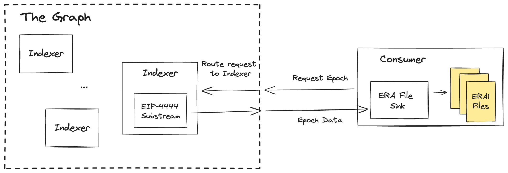

# Retrieving Historical Data from The Graph After EIP-4444

In this demonstration, we show how The Graph can be used to preserve and retrieve historical Ethereum data. The primary motivation is to show how The Graph solves the problem historical data preservation after Ethereum full-nodes begin pruning data as specified in EIP-4444. The current demonstration is only concerned with pre-merge Ethereum data.



At a high-level, Consumers who want historical data make a request to The Graph network, the request is routed to an Indexer(s) who is indexing historical data, and the Indexer fulfills the request. In the architecture proposed here, the Indexer is using the [Firehose](https://firehose.streamingfast.io/)-based indexing stack and is running a [Substream](https://substreams.streamingfast.io/) which extracts all of and only the data needed to preserve Ethereum's history. The Substream we are using is [here](https://github.com/semiotic-ai/era_file_substream). A key feature of Substreams is that they can be routed to many different types of sinks, e.g. PostgreSQL DB, CSV file, etc. In this demonstration, we are sinking the data to an[ ERA1 file](https://hackmd.io/@arnetheduck/H15vMzx2s). The motivation for sinking to ERA1 files is that this is the archival format for pre-merge data that client teams are using, e.g. [Geth](https://github.com/ethereum/go-ethereum/pull/26621).


In the example below, instead of making a request to The Graph network, we are simply using the Firehose endpoint provided by StreamingFast.

# Era File Sink

A Substream Sink that saves era files to disk.

## Usage

### Prerequisites

Get a StreamingFast API key first, which can be get from [here](https://app.streamingfast.io/login).
Then, use the next example to run it, passing that API key.

### Running

```bash
SUBSTREAMS_API_KEY="<StreamingFast API Token>" cargo run -- <output_directory> <start_era>:<end_era>
```

This will save the era files to the output directory.
